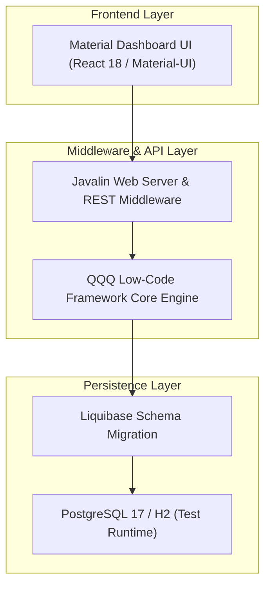

# Makers4

**Specialized Business Application Platform for Woodworkers & Cabinet Makers**

Makers4 is an application platform engineered specifically for custom woodworking shops, cabinet fabricators, and millwork manufacturers. Built on top of the [QQQ](https://github.com/QRun-IO/qqq) framework, Makers4 combines data model metadata, Liquibase schema management, automated CRUD REST APIs, and a Material Design dashboard into a single codebase.

---

## Technical Stack & Architecture



- **Core Framework**: QQQ Metadata Framework (Java 17+)
- **HTTP Server**: Javalin Web Framework & QQQ REST API Endpoint Router
- **Dashboard Interface**: React 18 & Material-UI Dashboard Engine
- **Database & Schema**: PostgreSQL 17 (Production/Dev), Liquibase Migration, H2 In-Memory (Test)
- **Build System**: Apache Maven 3.9+

---

## Environment Prerequisites

- **Java Development Kit (JDK)**: OpenJDK 17 or higher (`java -version`)
- **Build Automation**: Apache Maven 3.9+ (`mvn -version`)
- **Container Engine**: Docker Desktop or Podman (`docker --version`)

---

## Local Development Setup

### 1. Launch PostgreSQL 17 Container
Start a local PostgreSQL database container pre-configured with schema credentials:

```bash
# Launch PostgreSQL via Docker Compose
docker compose -f src/test/resources/postgres/docker-compose.yml up -d
```

### 2. Apply Database Migrations & Start Server
Set local environment variables, execute Liquibase schema updates, and launch the application:

```bash
# Export RDBMS Configuration
export RDBMS_VENDOR=postgresql
export RDBMS_HOSTNAME=localhost
export RDBMS_PORT=5432
export RDBMS_DATABASE_NAME=makers4
export RDBMS_USERNAME=devuser
export RDBMS_PASSWORD=devpass

# Execute Liquibase Migrations & Package Application
mvn liquibase:update
mvn clean package -DskipTests

# Run Application Jar
java -jar target/makers4.jar
```

Access the user interfaces:
- **Dashboard Web UI**: `http://localhost:8000/`
- **QQQ REST API Specification**: `http://localhost:8000/qqq-api/`

---

## Quality Gates & Verification

```bash
# Run Unit and Integration Test Suite (H2 In-Memory Database)
mvn test

# Run Code Quality & Dependency Verification
mvn checkstyle:check
```

---

## Customizing the Application Template

Makers4 includes a customizer script to re-brand and re-package the codebase for specialized custom manufacturing environments:

```bash
# Run Template Customizer Script
python3 scripts/customize_template.py
```

Follow the interactive prompts to configure `groupId`, `artifactId`, package namespace, and application labels.

---

## License & Intellectual Property

See [LICENSE](LICENSE) for full licensing terms and conditions.
